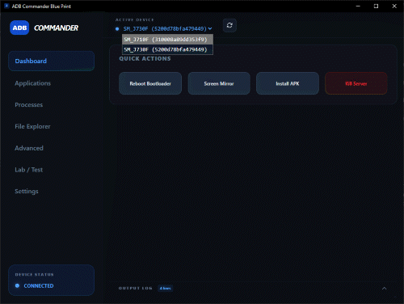

# BluePrint | Professional ADB Management Suite

**BluePrint** is a high-performance communication bridge between the desktop environment and Android devices. It consolidates fragmented ADB utilities into a cohesive, senior-grade graphical interface, enabling deep hardware diagnostics and real-time system manipulation.

### 🧩 Core Capabilities

* **System Diagnostics:** Instantaneous extraction of hardware parameters (CPU architecture, Manufacturer, Serial) and power metrics via precision battery monitoring.
* **Reactive Shell Emulator:** A low-latency terminal environment with data-pipe support, allowing direct interaction with the `/system/bin/sh` environment.
* **Intelligent Caching Layer:** Advanced state persistence for device metadata and system properties, significantly reducing ADB overhead and ensuring near-zero latency during context switching.
* **Advanced File Operations:** Dedicated module for remote filesystem management, supporting direct pull/delete operations and automated storage mount-point detection.
* **Bento-Grid UI:** A dense, high-readability dashboard designed for professional diagnostic workflows, utilizing modern design patterns for complex data visualization.

### 🛠 Tech Architecture

The suite operates on a high-performance hybrid architecture:
* **Core:** Low-level Go bindings for native ADB process orchestration and system-level execution.
* **Data Acquisition:** **Scrapy** engine for automated metadata extraction and advanced scraping from external device-related repositories.
* **UI Engine:** Svelte 5 (Runes) for ultra-efficient, reactive state management and high-density data rendering.
* **Bridge:** Wails IPC for secure, high-speed asynchronous communication between the native Go backend and the web-based frontend.

### 🖥️ BluePrint UI Showcase [Explore Interface Gallery](assets/PHOTOS.md)

  

### 👥 Collaborators

* **ZeroDayZ7** — Lead Developer / Architect
* **Gemini** — Adaptive AI Collaborator (Architecture Design, UI/UX Optimization & Debugging)

